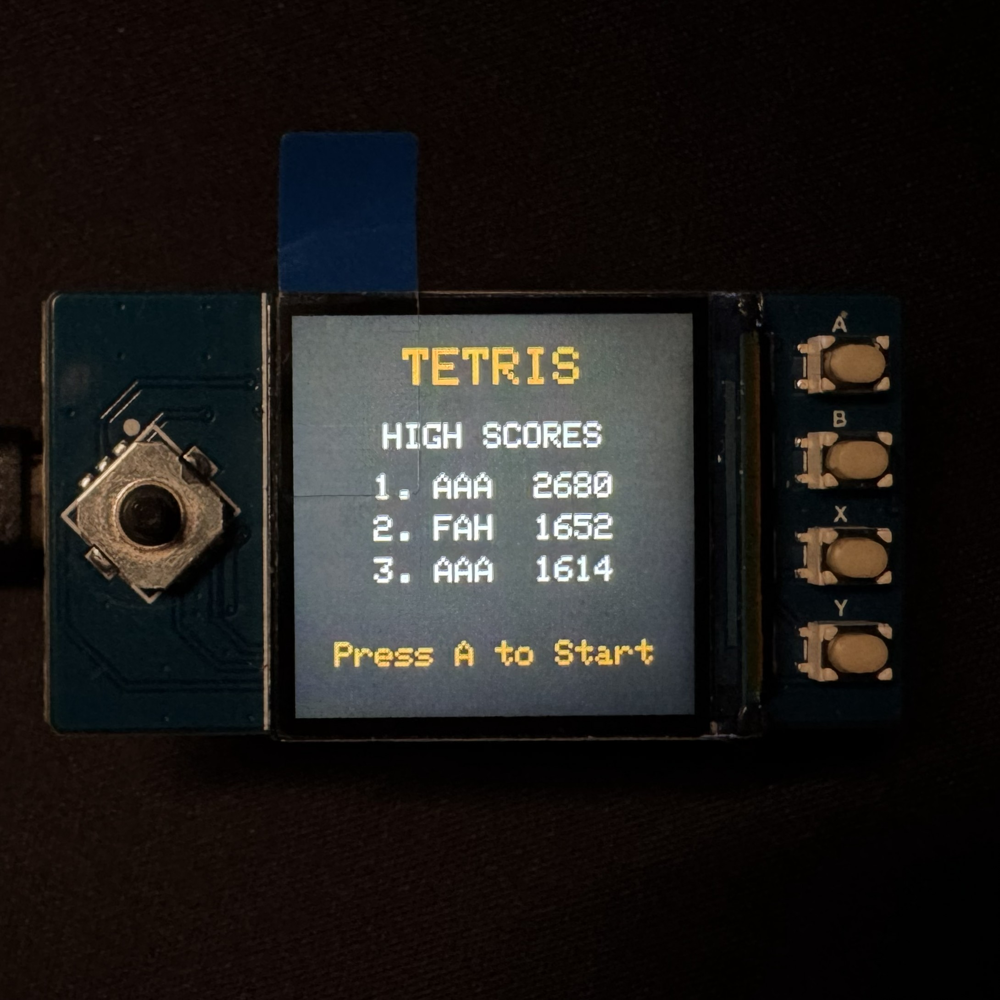
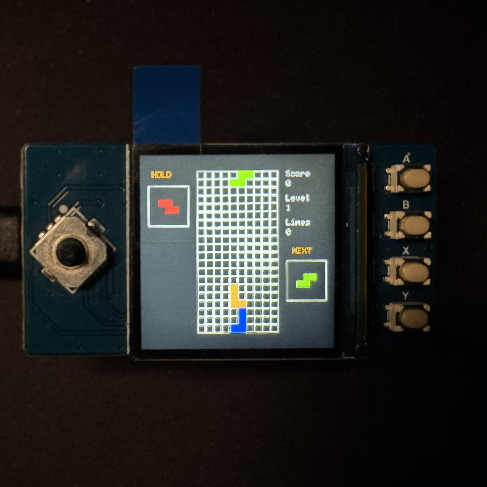
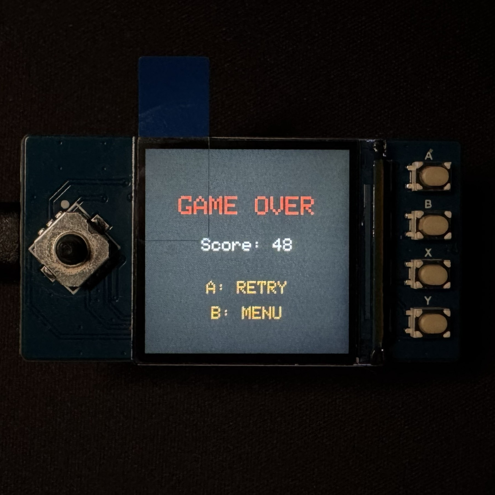

# Pico Tetris

A Tetris clone for the Raspberry Pi Pico 2 W with a 240×240 ST7789 display and physical joystick/button controls.

## Screenshots

<table>
  <tr>
    <td align="center"><br><strong>Start screen</strong><br>Persistent top-three leaderboard</td>
    <td align="center"><br><strong>Gameplay</strong><br>Colored board, Hold, Next, score, level, and lines</td>
    <td align="center"><br><strong>Game over</strong><br>Final score with retry and menu controls</td>
  </tr>
</table>

## Hardware

- Raspberry Pi Pico 2 W
- 240×240 ST7789 TFT display
- Five-direction joystick
- A, B, X, and Y buttons

The display uses SPI1 with SCLK on GP10, MOSI on GP11, CS on GP9, DC on GP8, reset on GP12, and backlight on GP13.

## Features

- 20×10 board with a white grid and all seven Tetrominoes in distinct standard colors
- Random queued pieces with colored active, locked, Hold, and Next-piece rendering
- Joystick movement, edge-triggered rotation, soft drop, and debounced hard drop
- Hard-drop distance bonus and immediate locking
- Once-per-piece Hold with spawn-position and rotation reset
- Wall, floor, locked-cell, spawn, and rotation collision detection
- 500 ms lock delay with movement/rotation resets and a reset limit
- Multi-line clearing, score tracking, level progression, and increasing fall speed
- Start screen, pause/resume overlay, and interactive game-over retry/menu flow
- Persistent top-three leaderboard with three-letter initials stored in emulated EEPROM
- Stored-score validation using a magic value, format version, and checksum
- Cell-level dirty rendering and cached Score, Level, Lines, Hold, and Next HUD updates

## Controls

| Input | Action |
| --- | --- |
| Joystick left/right | Move piece |
| Joystick down | Soft drop |
| Joystick up | Hard drop |
| Joystick center | No action |
| A | Rotate / confirm initials / start or retry |
| B | Hold piece / return to menu after game over |
| Y | Pause or resume |

During initials entry, joystick up/down changes the selected letter and left/right selects a position.

## Project Structure

```text
pico-Tetris/
├── pico-Tetris.ino       Application states, timing, and hardware input
├── game.*                Tetris rules and current game state
├── board.*               Locked-cell grid and line clearing
├── piece.*               Tetromino shape, position, and color
├── UI.*                  ST7789 screens and optimized rendering
└── highScoreStorage.*    Top-three EEPROM leaderboard
```

The board stores RGB565 colors for locked cells. The active piece remains separate until locking, and the renderer combines both into a cached 20×10 frame. Only cells and HUD panels whose values change are sent to the display.

High scores use the Arduino-Pico emulated EEPROM API. Stored data includes a magic value, format version, entry count, and checksum. EEPROM is written only after a player confirms a qualifying score.

## Building

Install the Earle Philhower Arduino-Pico core and the Adafruit GFX and ST7789 libraries, then select **Raspberry Pi Pico 2W** and compile `pico-Tetris/pico-Tetris.ino`.

With Arduino CLI:

```sh
arduino-cli compile --fqbn rp2040:rp2040:rpipico2w pico-Tetris
```

## Learning Goals

This project demonstrates embedded C++, non-blocking timing, physical input handling, game-state design, TFT rendering, flash-backed persistence, and separation of game rules from hardware-specific code.
